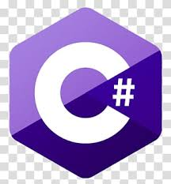
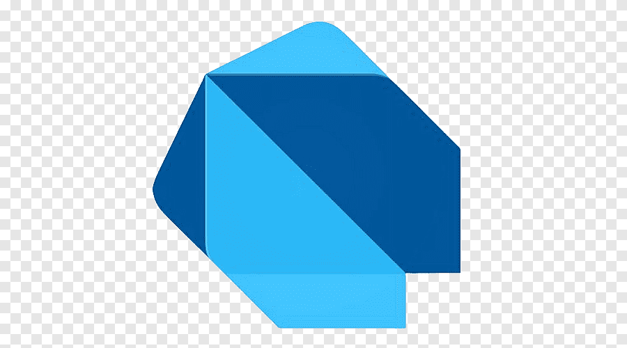
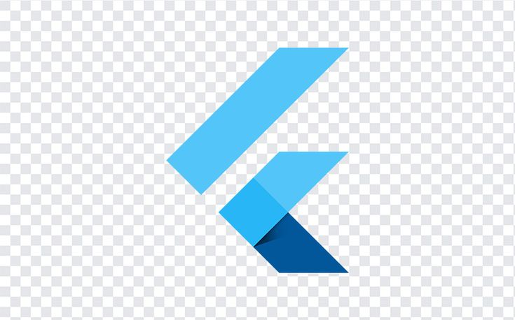

<!-- Afia Maham's Professional GitHub README -->
<h1 align="center">👋 Hello, I'm Afia Maham</h1>

  <em>
    🚀 3rd Semester BS Software Engineering Student at National Textile University. 
    💻 Passionate about coding, problem-solving, and building user-friendly applications. 
    📚 Learning Python, Data Structures, and Algorithms in C++.
  </em>

---

## 🌟 **About Me**
- 🎓 I know **C++, C#, Dart** and currently learning **Python and DSA in C++**.
- 💡 Worked with **Windows Forms, Flutter Frontend**, and **API Integration**.
- 🛠️ Experienced with **SQL** for database management.
- 🌐 Actively building projects and exploring **GitHub** for open-source contributions.
- 💼 I am open to **collaborations**, **internships**, and **new opportunities**.

---

## 🛠️ **Tech Stack**

  <!-- C++ -->
  
  
  <!-- C# -->
  
  
  <!-- Dart -->
  
  
  <!-- Python -->
  
  
  <!-- Flutter -->
  
  
  <!-- .NET -->
  

## 📫 **Connect with Me**

  <!-- LinkedIn -->
  
  
  <!-- Gmail -->
  

---

## 🚀 **What I'm Working On**
- 🌱 Improving my skills in **Data Structures and Algorithms**.
- 🎯 Exploring **Flutter** for mobile app development.
- 🔭 Building projects to expand my **portfolio**.

---

## 🎨 **Fun Fact**
I believe every line of code brings me closer to achieving my dreams. 🚀✨

  

